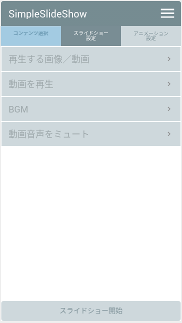
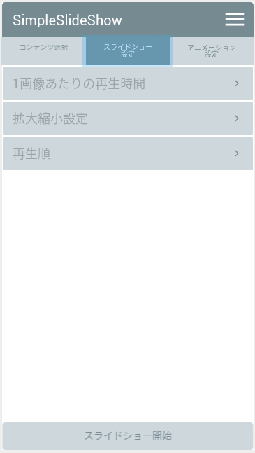
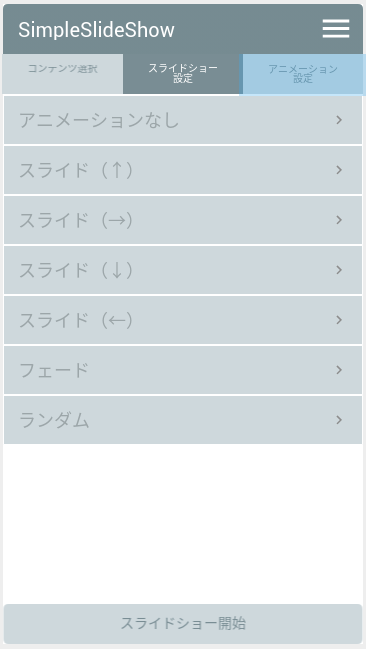

# 画面仕様

## 本書について

スライドショーアプリの制作において、必要となる画面とその遷移方法について定義する。

---

## 画面一覧

本アプリケーションは、以下に示す２つの画面から構成される。

1. 設定画面
1. スライドショー画面

設定画面でスライドショー表示する画像の選択や、再生時間、表示倍率、アニメーションなどを設定する。
設定完了後、設定画面の下部にあるボタンでスライドショー画面に遷移する。

設定画面は次の３つに分類して設定を行う。

- コンテンツ設定画面
- スライドショー設定画面
- アニメーション設定画面

これら３つの設定画面はタブで切り替えできるようにすること。
各設定画面で表示する項目はリスト化して表示すること。

以下に、各画面の実装イメージを示す。

#### コンテンツ設定画面

#### スライドショー設定画面

#### アニメーション設定画面

---

## 画面遷移

画面構成および画面を操作時の遷移方法を記載する。
fluidにて作成。下記ページを参照。

[SimpleSlideShow][1]

[1]:https://www.fluidui.com/editor/live/preview/cF9uZVJGbzhSY1pLNXZQMlV4SUl5cmhaN0lEeFRiNm5HeQ==

---

## 画面構成部品

### コンテンツ設定画面

下記[A]?[D]に設定する内容および表示項目を示す。

[A] **再生する画像／動画**
- 項目をタップして項目を選択するアプリを呼び出す。
- 再生する画像／動画のファイル名を補足として表示すること。
- 項目の右側にディレクトリを示す画像を配置する。

[B] **動画を再生**
- 項目をタップして、動画を選択時に動画を再生有無を設定する。
- 項目の右側にチェックボックスを配置する。
- デフォルトでチェック有りとなっていること。

[C] **BGM**
- 項目をタップして項目を選択するアプリを呼び出す。
- 再生する音楽ファイル名を補足として表示すること。
- 項目の右側にディレクトリを示す画像を配置する。

[D] **動画音声をミュート**
- 項目をタップして、動画再生時の音声有無を設定する。
- 項目の右側にチェックボックスを配置する。
- デフォルトでチェック無しとなっていること。

### スライドショー設定画面

下記[A]?[C]に設定する内容および表示項目を示す。

[A] **1画像あたりの再生時間**
- 項目をタップして1画像あたりの再生時間を設定する。
  - 設定できる再生時間は下記の範囲で1秒単位で指定できること。
    - 最小：1秒
    - 最大：60秒
- 再生時間を補足として表示する。
- デフォルトでは再生時間を10秒とすること。

[B] **拡大縮小設定**
- 項目をタップして、スライドショー表示時の拡大縮小設定を次のリストから選択する。
  - オリジナルサイズ
  - 画面にフィット
  - 全画面表示（縦横比保持）
  - 全画面表示（縦横比保持しない）
- デフォルトでは"画面にフィット"となっていること。
- 設定した内容を補足として表示する。

[C] **再生順**
- 項目をタップして、スライドショー表示する順番を次のリストから選択する。
  - 項目選択順
  - ファイル名の降順
  - ファイル名の昇順
  - ファイル更新日時の降順
  - ファイル更新日時の昇順
- デフォルトでは"項目選択順"となっていること。
- 設定した内容を補足として表示する。

### アニメーション設定画面

スライドショー表示時の表示画像切替時のアニメーションを下記[A]?[H]に示す設定から１つのみ選択されるようにする。

[A] **アニメーションなし**
  - 即時に切り替える

[B] **スライド（↑）**
  - 上方向にスライドして移動しながら切り替える。

[C] **スライド（→）**
  - 右方向にスライドして移動しながら切り替える。

[D] **スライド（↓）**
  - 下方向にスライドして移動しながら切り替える。

[E] **スライド（←）**
  - 左方向にスライドして移動しながら切り替える。

[F] **スライド（暗）**
  - 明度が徐々に暗くなっていき、真っ黒の画面から次の画像が徐々に明るくなりつつ表示される。

[G] **スライド（明）**
  - 明度が徐々に明るくなっていき、真っ白の画面から次の画像が徐々に暗くなりつつ表示される。

[H] **ランダム**
  - 画像切り替え時に上記[A]?[G]のいずれかの方法でランダムに切り替わる。

